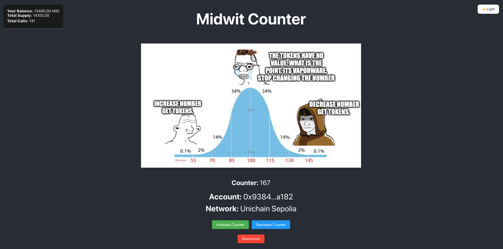
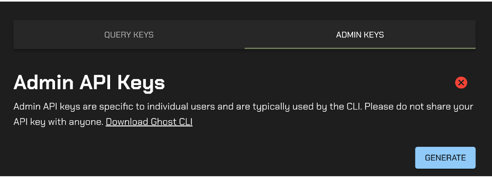
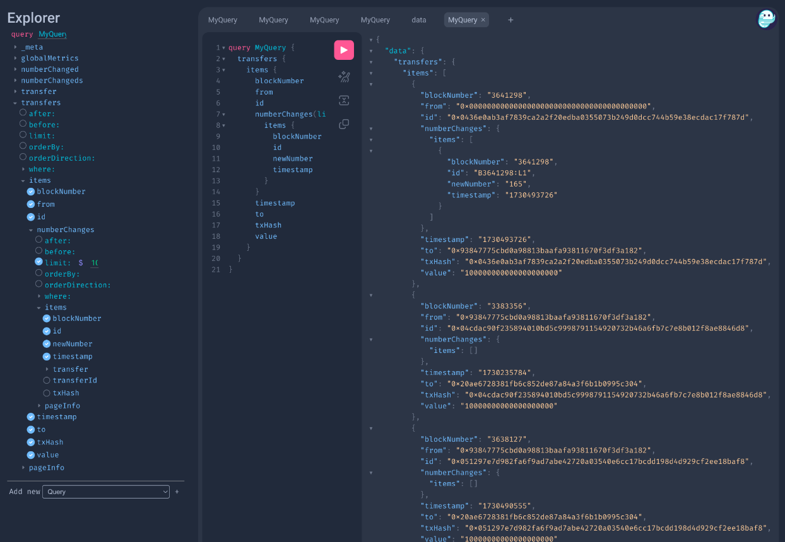

# Midwit Token Indexer w/ [Ghost Graph](https://tryghost.xyz/){:target="_blank"}  👻
This repo contains an example of how to index events from a smart contract and query them through a Ghost Graph. We have 3 key components:  
g
1. Smart Contracts
2. Ghost Graph
3. Frontend

Our contract will be a simple increment and decrement counter deployed to [Unichain Testnet](https://www.unichain.org/). Each time the contract is incremented or decremented we will transfer tokens to the address of the caller,and an event will be emitted. We will index these events into a Ghost Graph and then query them through our frontend. 


Questions?  
Feel free to reach out on [X](https://x.com/doyle126)
Have questions about Ghost Graphs? Join their [telegram chat](https://t.me/ghostlogsxyz)


## Smart Contracts: 

`forge init midwit-contracts`
`cd midwit-contracts`
`forge install OpenZeppelin/openzeppelin-contracts`

update foundry.toml: `remappings = ['@openzeppelin/=lib/openzeppelin-contracts/']`
`forge remappings > remappings.txt`

deploy contract
`forge create src/Counter.sol:Counter --rpc-url $RPC_URL --chain-id 1301 --private-key $PRIVATE_KEY`

 Now lets make a few calls to our contract so we can have some event data later for indexing. Using Cast we can call function on our contract from the terminal.  This will help us generate some event data to start indexing.  Play around with cast if you need to seed some data for indexing. 

Lets call increment 30 times. 
```
for i in {1..30}; do
  cast send 0xEC87E4C8Ac38Ff4ECe7D0E36CdBDF42c39FcE903 'increment()' --rpc-url $RPC_URL --private-key $PRIVATE_KEY
done
```

Lets call decrement 13 times. 
```
for i in {1..13}; do
  cast send 0xEC87E4C8Ac38Ff4ECe7D0E36CdBDF42c39FcE903 'decrement()' --rpc-url $RPC_URL --private-key $PRIVATE_KEY
done
```

I will also transfer some tokens to an address to get a few more transfer events and more holders. 
```
for i in {1..100}; do
  cast send 0xEC87E4C8Ac38Ff4ECe7D0E36CdBDF42c39FcE903 "transfer(address,uint256)" 0x20ae6728381Fb6C852de87A84A3F6b1B0995c304 10000000000000000000 --rpc-url $RPC_URL --private-key $PRIVATE_KEY
done
```


We will now have some `transfer` data, some `numberUpdated` events that we can start indexing. 

-----------------------

## Ghost Graph 

Install GhostCLI https://github.com/tryghostxyz/ghost-cli 

Make sure you create a ghost API. 



Our API key will allow us to generate our Ghost Graph. 

Since we are we deployed our contract to Unichain Testnet, we will generate our Ghost Graph for the Unichain Testnet. 

`ghost create --chain 1301 midwit_indexer`

Once we populate our `events.sol` file and our `schema.sol` file, we can run `ghost codegen` to create the rest of our files needed for our indexer. 

Codegen will create a bunch of helper files. We will focus primarilty on the `indexer.sol` file. 

After creating the logic within the `indexer.sol` file, we can deploy our indexer. 

We run `ghost compile` and `ghost deploy`. This will create our indexer and give us a gql endpoint to query our indexer. 


-----------------------

## Frontend

We will use the `midwit-frontend` repo to query our Ghost Graph. 

Once your indexer is deployed ensure that you swap out the `YOUR_GHOST_GRAPH_ENDPOINT` and `GHOST_API_KEY` with your Ghost Graph endpoint and API key in the `DataDisplay.js` file. 

`cd midwit-frontend`
`npm install`
`npm run start`

This will bring up our frontend application which is connect both to our smart contract and our Ghost Graph. 